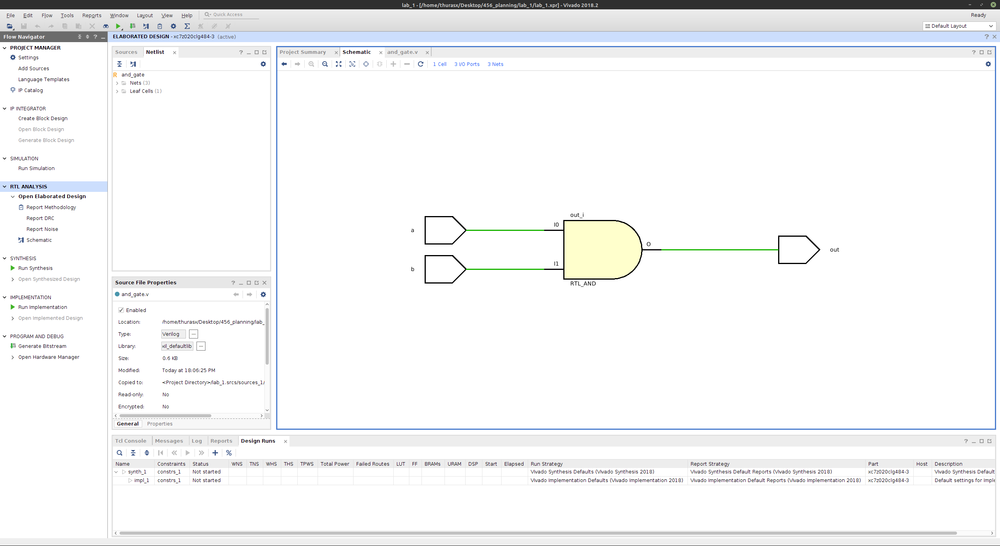
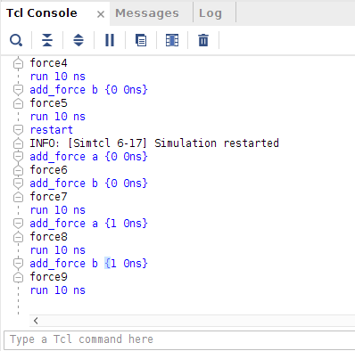

# Project creation
Start the project
1. Use the Windows key to bring up the search bar for Vivado.
2. Start Vivado.
3. Under Quick Start, choose Create Project.
4. Hit Next to use the assist at creating projects (Wizard).
5. Fill in the project name (lab1_gates) and file location.
6. Default is rtl project, which is what you want so just click Next.
7. Don't create a new file yet, just click Next.
8. No constraint file yet, so just click Next again.
9. Select the `parts` -> Category:-> `general purpose` -> Family: `Zynq-7000` -> `xc7z020clg484-3`.
10. Choose Finish.

# Editing file
1. In the middle Sources window choose the plus tab.
2. Choose add or create design sources. Click Next.
4. Create new file by choosing the plus tab again, -> Create File. Name it `and_gate`.
5. In the future you can specify parameters to your Module here, but for now lets make sure 
   to learn the whole structure of a Verilog program so you can write it yourself. Just click OK.
6. Click Yes.
7. Now you will notice in the Sources Window under Design Sources that the and_gate file has been created.
8. Double click on the file and it will open a window on the right side.
9. Fill in the team member names under Engineer. As well as the other pertinent information.
    
3. Create the `AND`  gate by typing in the Verilog below. Note that this module is not really necessary, but this is a learning experience. The and gate specification within the verilog module, and(out, a, b), is and example of structural verilog.

<!--    ## Format -->
 <!--    *gate*(*output*, *input1*, *input2*) -->

```verilog
//Example AND gate
module and_gate(
    input a, 
    input b, 
    output out
);
and(out, a, b);
endmodule
```

4. View the gate 

    RTL Analysis -> Open Elaborated Design 

    
# Simulation
1. `Run simulation` -> `Run behavioral simulation`
2. Use the tcl (the command line) commands or UI (user interface) buttons to run the simulation. tcl commands are listed below to run the simulation
3. When launching the simulation, all the signals will be in high impedence state or `Z` and output will be `X`
4. To start the simulation from 0 timestep, type in `restart` in tcl
5. Force a constant value on an input line (signal)

    1) Select the signal -> right click -> force constant -> force value -> 1
   
   

   

    2) tcl console -> add_force *input name* {value timestep}
        
       ``` verilog 
        add_force A {1 0ns} 
        ```
6. Step into timestep to see the wave form (timing diagram) of the signal
   
   1) The play button with a subscript "T" adds the additional runtime specified in the box immediately to its right. Specify the time to step to next wave
   2) type into tcl console
    ```verilog
        run 10ns
    ```

7. Restart the simulation 
   1) The circle arrow  button will reset and rerun the simulation.
   2) Type into tcl console
   ```verilog 
        restart
   ```

8. Inspecting wave form (timing diagram)
   1) Use the magnifying glass in UI (See the description for details)
   2) Use the following tcl commands
   ```verilog
        zoom fit 
        zoom in
        zoom out
   ```
9. This is an example simulation for `AND` gate using tcl commands
    
    
    
10. Once you have a timing diagram of all possible input and output combinations of an AND gate, ask the TA or instructor to view your diagram. They will ask you a few "check-off" questions. 
11. Take a screen shot of the circuit and the timing diagram for your lab report. You will submit a lab report to Canvas. For today's lab that will simply be a header with Lab 01 - Gates, on the top right hand side should be the names of the lab partners. Then you should insert your screen shots of the circuit and timing diagram.
12. A lab report with only the AND gate screen shots will be 70%. Try to also simulate OR, XOR and NOT and take circuit and timing diagram screen shots. Each of these will be worth 10%.
